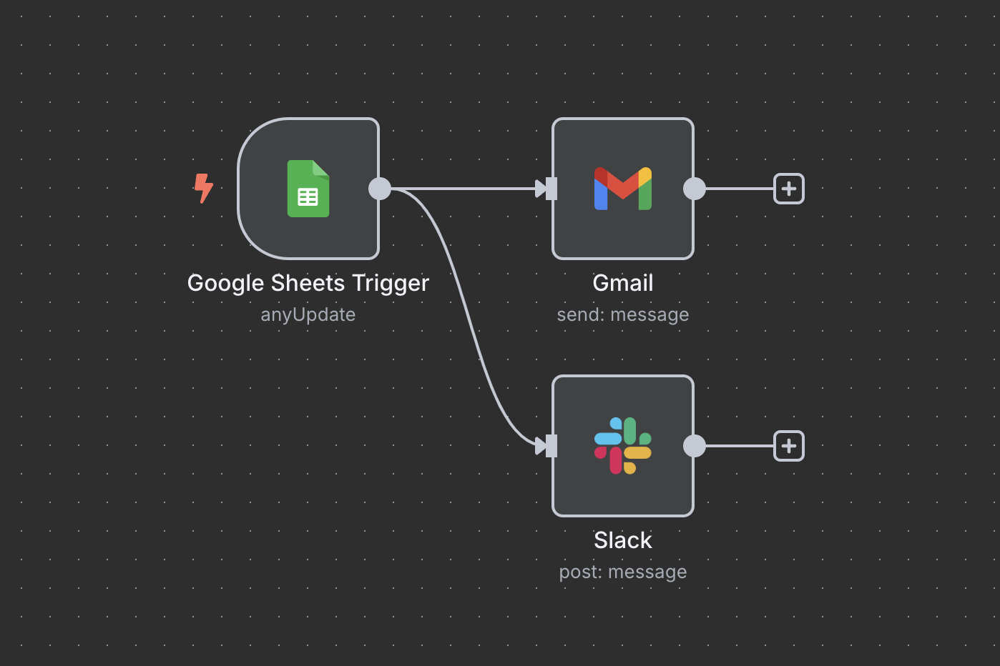

# ✨ Landing Page Email Auto-Responder (n8n)

---

This project is a **fully automated workflow** built with [n8n](https://n8n.io), designed to improve the onboarding experience for new email signups through a landing page.

When someone signs up, this automation kicks in and sends a personalized welcome email and a slack message with the signup info — no manual work required.

## 🖼 Visual Snapshot

---

## 🚀 What It Does

- **Listens** for new signups added to a **Google Sheet**
- **Sends** a welcome email via **Gmail** (or your preferred provider)
- **Sends** a Slack Bot message to a **slack channel** with the **email info**
- Runs on autopilot every few minutes

---

## 🔧 Workflow Breakdown

1. **Trigger:** New row added in a Google Sheet
2. **Action:** Send a personalized welcome email
3. **Action:** Send the email info to slack

That's it — lightweight, effective, and easy to customize.

---

## 🛠 How to Use

1. Import the `.json` file into your n8n instance
2. Connect your **Google Sheets**, **Slack API** and **Email** credentials
3. Customize the email message
4. Deploy or run locally

> Optional: Use the diagram image to get a quick visual overview of the workflow.

---

## 🧩 Built With

- [n8n](https://n8n.io)
- Google Sheets
- Gmail (or any SMTP-compatible email service)
- Slack API

---

## 🌱 Extend This Workflow

This automation is a perfect starting point. Here are a few ways to level it up:

- Add a **lead enrichment** step using Clearbit
- Start a **multi-step onboarding email series**
- Sync new leads to your **CRM** or **Notion database**

---

Make it yours — automate the boring stuff and focus on what matters.
